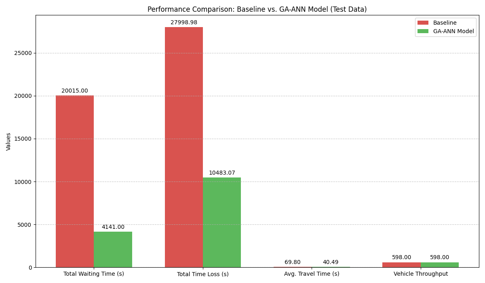

# 🚦 Artificial Neural Network for Adaptive Urban Traffic Signal Control in SUMO

**Authors:** Harish R, Namitha Madhu  
*Department of Electrical and Electronics, Amrita Vishwa Vidyapeetham, Coimbatore, India*

---

## 📄 Abstract

Urban cities face major consequences from traffic congestion and long wait times at traffic joints. Conventionally used fixed-time traffic signals are proving to be non-effective as vehicles and people waste a significant amount of time waiting at signals.

This paper adopts a **neuro-evolutionary approach**, combining a **Genetic Algorithm (GA)** and an **Artificial Neural Network (ANN)**, to determine the optimal signal time based on real-time traffic presence.

- The **ANN** model acts as the controller (decision-maker) during the simulation.
- The **GA** optimizes (trains) the ANN model for better accuracy by adjusting its weights to reduce vehicle waiting time.

The simulation was implemented and analyzed using the **Simulation of Urban Mobility (SUMO)** environment, using real-time data from a street in Bremen, Germany. When compared to the baseline fixed-time controller, the optimized GA-ANN model demonstrated a **79.31% improvement in the waiting time** of vehicles and lower average traffic congestion.

**Index Terms:** *Neuroevolution, Genetic Algorithm, Artificial Neural Network, Traffic Signal Control, SUMO, Optimization, Intelligent Transportation Systems*

---

## 🚦 Simulation Environment & Methodology

### Simulation Tool
The control logic and optimization algorithm were implemented in **Python**, interfacing with the **SUMO** microscopic traffic simulator using the **TraCI** library.

### Location & Dataset
The simulation scenario is based on real-world traffic data from the **"CN+ Vehicular Dataset"** for a traffic light-regulated intersection in **Bremen, Germany**.


### Methodology
The system is designed to find the optimal green light duration. The ANN functions as the real-time decision-making model, while the GA optimizes the ANN's weights to enhance signal efficiency and reduce congestion.

The methodology is organized into four main steps:

1. Simulation Environment Setup  
2. GA-ANN Model Design  
3. Simulation Execution (Baseline vs. GA-ANN)  
4. Performance Metrics Collection  

#### Process Flowchart  
This diagram illustrates the training loop, where the GA iteratively evaluates generations of ANNs in SUMO to find the best-performing controller.


---

## ⚙️ GA-ANN Model Architecture

### 1. Artificial Neural Network (ANN)
The ANN is a single-layer, feed-forward network that predicts the optimal green phase duration.

- **Input Nodes:** 3 (corresponding to the number of halting vehicles on monitored lanes)  
- **Hidden Layer:** 10 nodes (sigmoid activation function)  
- **Output Layer:** 1 node (sigmoid activation function)  
- **Output Scaling:** Output value (0–1) scaled to green phase duration between 10s and 60s.  

### 2. Genetic Algorithm (GA)
The GA optimizes the weights and biases of the ANN controller. The goal is to evolve a population of ANN controllers over multiple generations to minimize total vehicle waiting time.

**Fitness Function:**

```latex
Fitness = \frac{1}{1 + W_{total}}
```

**GA Parameters:**

| Parameter | Value |
| :--- | :--- |
| Population Size | 50 |
| Number of Generations | 100 |
| Selection Method | Tournament Selection (k=3) |
| Elitism Count | 1 (Best individual) |
| Crossover Rate | 0.8 |
| Crossover Method | Single-Point |
| Mutation Rate | 0.05 |
| Mutation Method | Gaussian Noise (μ=0, τ=0.2) |

---

## 📊 Results and Discussion

The optimized GA-ANN controller was validated on an unseen test scenario from the dataset and compared against a fixed-time baseline controller.

### Key Performance Indicators

| Metric | Fixed-Time Controller | GA-ANN Controller | Improvement |
| :--- | :---: | :---: | :---: |
| Total Waiting Time | 20015 s | 4141 s | 79.31% ↓ |
| Total Time Loss | 27998.98 s | 10483.07 s | 62.55% ↓ |
| Average Travel Time | 69.80 s | 40.49 s | 41.99% ↓ |
| Vehicle Throughput | 590 | 598 | +1.35% ↑ |



---

### GA Training Convergence
The GA convergence plot shows the waiting time of the best individual (blue) rapidly decreasing within the first 20 generations, surpassing the baseline controller (red dashed).


---

### Dynamic Queue Length
The baseline controller (red) shows significant spikes in queue length, whereas the GA-ANN controller (green) maintains a much lower and stable queue.


---

### Distribution of Vehicle Wait Times
- **Baseline (Red):** Many vehicles experience moderate to high waiting times.  
- **GA-ANN (Green):** Most vehicles fall into the minimal waiting time bracket.

  


---

### Travel Time and Time Loss Distributions
The GA-ANN model successfully shifts the entire distribution of travel times and time losses to the left, reducing long delays.


---

## 🏁 Conclusion

This work successfully demonstrated an adaptive traffic light controller by optimizing an ANN with a GA. The controller, trained and validated within the SUMO environment using real-world data from Bremen, Germany, achieved a **79.31% reduction in total waiting time** compared to a traditional fixed-time controller. This superior performance was also reflected in reduced average travel times, lower total time loss, and more effective queue management.

---

## 🚀 Future Work

While the current model shows promising results for an isolated intersection, future research avenues include:

1. **Network-Level Control:** Extending the approach from a single intersection to a coordinated network of multiple intersections.  
2. **Richer Input Data:** Enhancing the ANN's input features to include time of day, vehicle density, and average speed.  
3. **Algorithm Comparison:** Benchmarking the GA-ANN approach against other modern control techniques, particularly Deep Reinforcement Learning.  
4. **Multi-Objective Optimization:** Adapting the GA's fitness function to be multi-objective, simultaneously optimizing for waiting time, throughput, and emissions.  
