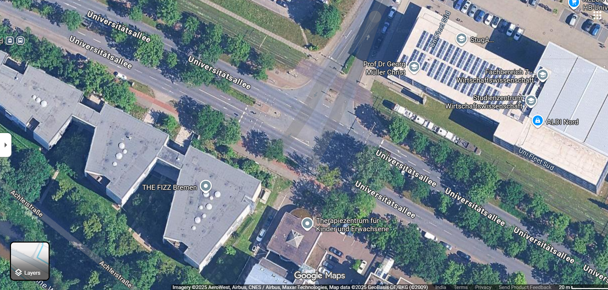
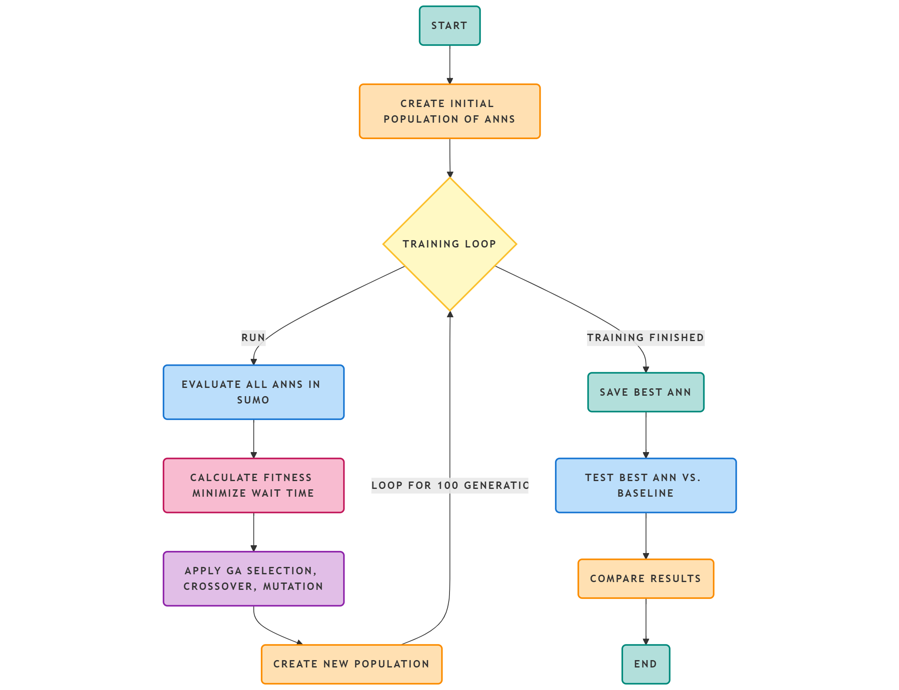
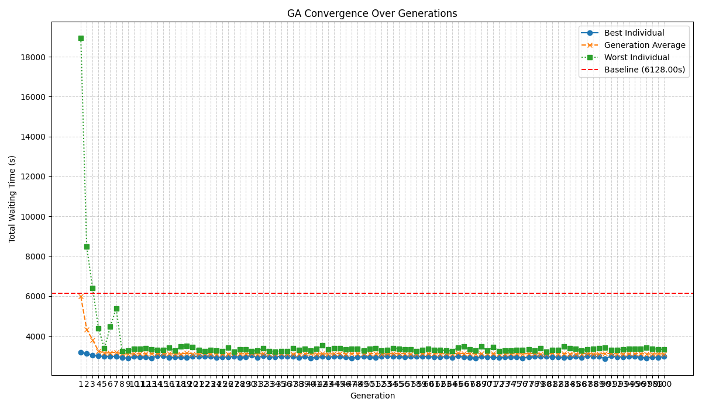
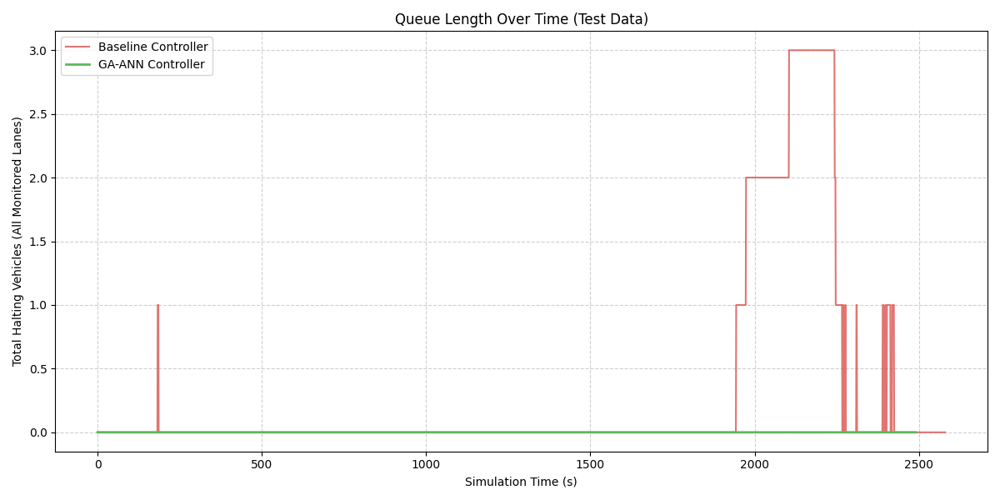
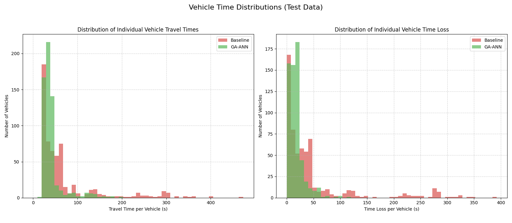
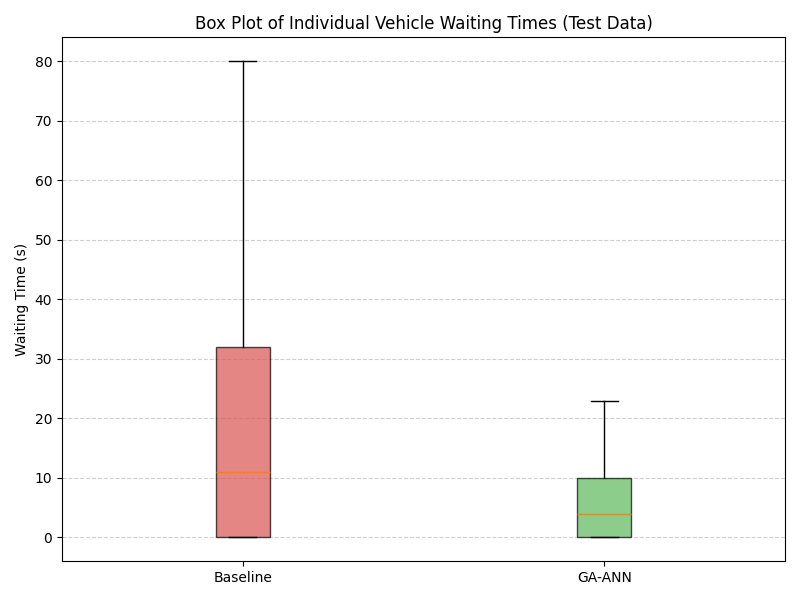
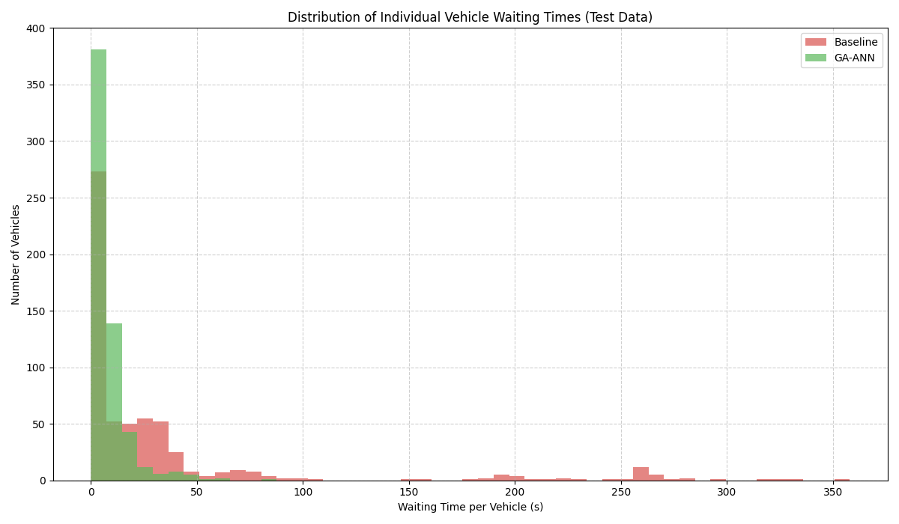

# 🚦 Artificial Neural Network for Adaptive Urban Traffic Signal Control in SUMO

## 👩‍💻👨‍💻 Authors

**Harish R** & **Namitha Madhu**  
🏫 Department of Electrical and Electronics Engineering,  
Amrita Vishwa Vidyapeetham, Coimbatore, India


---

## 📄 Abstract

Urban cities face major consequences from traffic congestion and long waiting times at intersections. Fixed-time traffic signals are inefficient since they cannot adapt dynamically to fluctuating traffic conditions.

This work presents a **Neuro-Evolutionary approach** combining a **Genetic Algorithm (GA)** and an **Artificial Neural Network (ANN)** to optimize signal timings based on real-time traffic density.

* **ANN**: Controller that dynamically allocates green times.
* **GA**: Optimizes ANN weights to minimize total waiting time and delay.

Implemented in **Python** and simulated using **SUMO (Simulation of Urban Mobility)**. Real-world data from a traffic junction in **Bremen, Germany** was used for validation. The GA-ANN system demonstrated a **79.31% improvement** in total waiting time over conventional fixed-time control.

**Keywords:** Neuroevolution, Genetic Algorithm, Artificial Neural Network, Traffic Signal Optimization, SUMO, Intelligent Transportation Systems

---

## 🧭 Methodology Overview

### 1️⃣ Simulation Environment

* **Tool:** SUMO
* **Interface:** Python – TraCI API
* **Dataset:** CN+ Vehicular Dataset (Bremen, Germany)



---

### 2️⃣ Flowchart



---

## ⚙️ GA–ANN Model Design

### Artificial Neural Network (ANN)

| Parameter    | Description                           |
| ------------ | ------------------------------------- |
| Inputs       | Number of halting vehicles in 3 lanes |
| Hidden Layer | 10 neurons (sigmoid activation)       |
| Output       | Green time (scaled between 10s – 60s) |

### Genetic Algorithm (GA)

| Parameter       | Value                      |
| --------------- | -------------------------- |
| Population Size | 50                         |
| Generations     | 100                        |
| Crossover Rate  | 0.8                        |
| Mutation Rate   | 0.05                       |
| Selection       | Tournament (k=3)           |
| Elitism         | Top 1 individual preserved |

**Fitness Function:**

```latex
Fitness = 1 / (1 + W_total)
```

Where `W_total` = total vehicle waiting time per cycle.

---

## 🧩 System Architecture

```
📁 Project Folder
├── train_model.py
├── test_model.py
├── config/
│   ├── CN+ Dataset.sumocfg
│   ├── network.net.xml
│   ├── routes.rou.xml
│   └── additional.add.xml
├── results/
│   ├── best_ann_weights.npy
│   ├── ga_convergence_plot.png
│   ├── test_performance_comparison.png
│   ├── wait_time_boxplot.png
│   ├── wait_time_histogram.png
│   ├── tripinfo_baseline.xml
│   └── tripinfo_ga_run.xml
└── README.md
```

---

## 🧩 CN+ Dataset

The **CN+ Dataset** consists of real-world traffic data from **Bremen, Germany**. It includes network topology, traffic routes, and additional configuration files required for SUMO simulations.

### Folder Structure

**1. Infrastructure Files**

| File                  | Description                                    |
| --------------------- | ---------------------------------------------- |
| `network.net.xml`     | SUMO network file defining lanes, edges, nodes |
| `CN+ Dataset.sumocfg` | Main SUMO configuration file                   |
| `additional.add.xml`  | Additional configurations like traffic lights  |

**2. Scenario Files**

Contains **49 route files**, representing traffic flows on different days.

---

### 🔧 Updating Paths

1. **In Python code (`train_model.py` / `test_model.py`)**:

```python
CONFIG_FILE = r"D:\Path\to\CN+ Dataset\Infrastructure Files\CN+ Dataset.sumocfg"
TEST_CONFIG_FILE = r"D:\Path\to\CN+ Dataset\Infrastructure Files\CN+ Dataset.sumocfg"
```

2. **In SUMO config file (`CN+ Dataset.sumocfg`)**:

```xml
<input>
    <net-file value="D:/Path/to/CN+ Dataset/Infrastructure Files/network.net.xml"/>
    <route-files value="D:/Path/to/CN+ Dataset/Scenario Files/routes.rou.xml"/>
    <additional-files value="D:/Path/to/CN+ Dataset/Infrastructure Files/additional.add.xml"/>
</input>
```

---

## 🧠 How to Run the Code

### ⚙️ Prerequisites

* **SUMO:** [Download SUMO](https://www.eclipse.org/sumo)
* Add to system PATH:

```bash
setx SUMO_HOME "C:\Program Files (x86)\Eclipse\Sumo"
```

* **Python Libraries:**

```bash
pip install numpy matplotlib
```

* Verify SUMO installation:

```bash
echo %SUMO_HOME%
```

---

### 🧩 Training

**File:** `train_model.py`

1. Update SUMO configuration path.
2. Run:

```bash
python Train.py
```

* Output: `best_ann_weights.npy`, convergence plots, trip info XMLs.

---

### 🧪 Testing

**File:** `test_model.py`

* GUI:

```bash
python Test.py
```

* Without GUI:

```bash
python Test.py --nogui
```

* Output: visual simulation and plots in `/results`

---

### ⚠️ Notes

* Keep Python scripts and SUMO config files in the same directory.
* Use **raw strings (r"path")** for Windows paths.
* Close SUMO GUI before rerunning.

---

## 📊 Results

| Metric             | Fixed-Time | GA–ANN     | Improvement  |
| ------------------ | ---------- | ---------- | ------------ |
| Total Waiting Time | 20015 s    | 4141 s     | **79.31% ↓** |
| Total Time Loss    | 27998.98 s | 10483.07 s | **62.55% ↓** |
| Avg. Travel Time   | 69.80 s    | 40.49 s    | **41.99% ↓** |
| Vehicle Throughput | 590        | 598        | **↑ 1.35%**  |

### 🔁 GA Convergence



### 🚗 Queue Length



### ⏱ Wait Time Distribution




### 🧍‍♂️ Travel Time & Time Loss



---

## 🏁 Conclusion

Adaptive traffic signal controller using GA–ANN achieved:

* **79.31% reduction** in total waiting time
* Improved throughput and average travel time

Bio-inspired optimization effectively enhances urban traffic management.

---

## 🚀 Future Enhancements

1. Multi-intersection control
2. Integration with real-time traffic cameras or IoT sensors
3. Comparison with Reinforcement Learning controllers
4. Multi-objective GA for fuel efficiency and emissions

---

## 🧩 Citation

> Harish R, Namitha Madhu, *“Artificial Neural Network for Adaptive Urban Traffic Signal Control in SUMO,”* Department of Electrical and Electronics Engineering, Amrita Vishwa Vidyapeetham, Coimbatore, India, 2025.

---

## 📧 Contact

**Harish R**  
🏫 Dept. of EEE, Amrita Vishwa Vidyapeetham, Coimbatore, India  
📧 [harishr.vnr@gmail.com](mailto:harishr.vnr@gmail.com)  
🔗 [LinkedIn](https://www.linkedin.com/in/harish-r-8b68a333b/)  
💻 [GitHub](https://github.com/Hackyharish)  

**Namitha Madhu**  
🏫 Dept. of EEE, Amrita Vishwa Vidyapeetham, Coimbatore, India  
📧 [cb.en.u4eee23149@cb.students.amrita.edu](mailto:cb.en.u4eee23149@cb.students.amrita.edu)  
🔗 [LinkedIn](https://www.linkedin.com/in/namitha-madhu-4934a8276/)  
💻 [GitHub](https://github.com/namitha-madhu)

